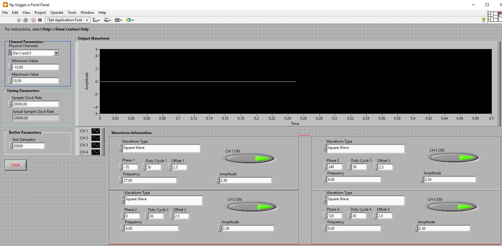
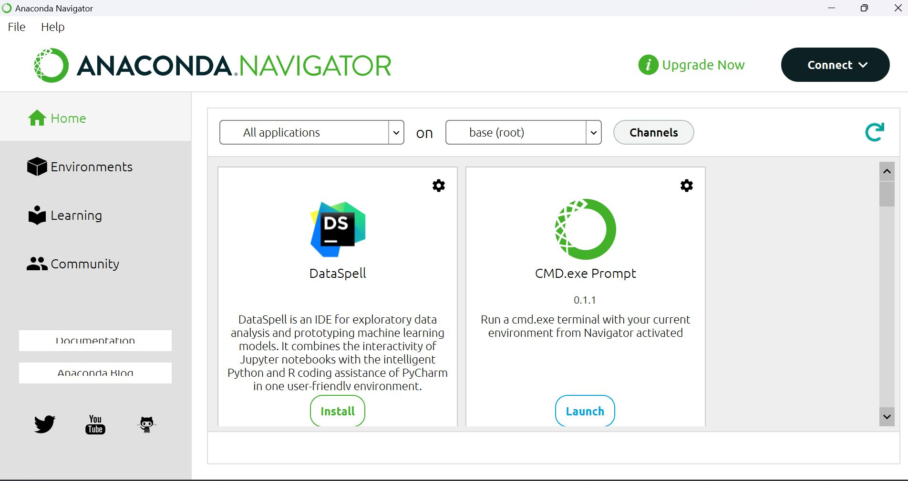
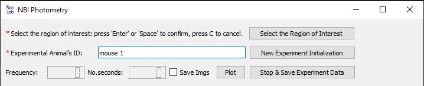
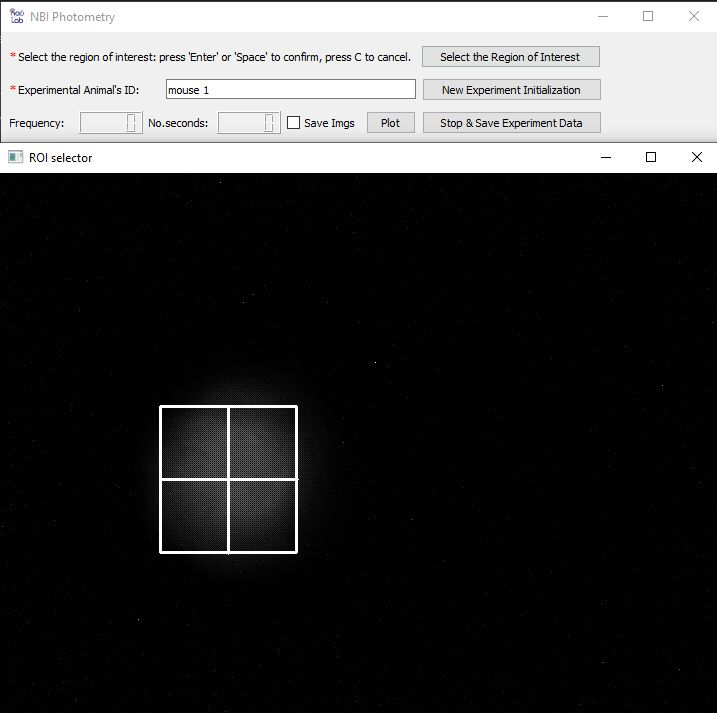
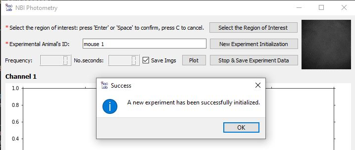
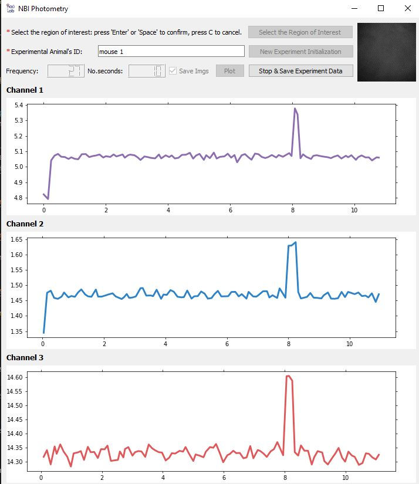
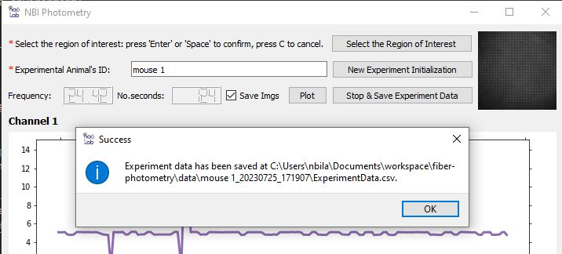

# Fiber Photometry

This repository contains code and documentation for a flexible and versatile system for multi-color fiber photometry using GCaMP6s and ChrimsonR. The system is designed to enable researchers to perform high-quality, reliable fiber photometry experiments using a variety of experimental designs. 

## Features

- Multi-color fiber photometry system
- Compatible with GCaMP6s and ChrimsonR
- Flexible and versatile design for use with a variety of experimental designs
- High-quality and reliable data collection

## System Setup
### Purchasing List

|Company |  Name |  Catalog Number |  Quatity |  Unit Size |  Price (USD) |
|-------|-------|------|----------|------------|------------|
|  Thorlabs |  Adaptor |  [SM1A3TS](https://www.thorlabs.com/thorproduct.cfm?partnumber=SM1A3TS) |  1 |  1 |  \$25.41  |
|  Thorlabs|  Dichroic|  [DMLP490R](https://www.thorlabs.com/thorproduct.cfm?partnumber=DMLP490R)|  1|  1|  \$273.69  |
| SEMROCK |  Dichroic |  [Di01-R405/488/594-25X36](https://www.idex-hs.com/store/product-detail/di01_r405_488_594_25x36/fl-006958) |  1 |  1 |  \$630  |
|  Thorlabs |  Bandpass filter |  [FBH410-10](https://www.thorlabs.com/thorproduct.cfm?partnumber=FBH410-10) |  1 |  1 |  \$161.44  |
|  Thorlabs |  Bandpass filter |  [FBH470-10](https://www.thorlabs.com/thorproduct.cfm?partnumber=FBH470-10) |  1 |  1 |  \$161.44  |
|  Thorlabs |  Bandpass filter |  [FBH510-10](https://www.thorlabs.com/thorproduct.cfm?partnumber=FBH510-10) |  1 |  1 |  \$161.44  |
|  Thorlabs |  Bandpass filter |  [FBH590-10](https://www.thorlabs.com/thorproduct.cfm?partnumber=FBH590-10) |  1 |  1 |  \$161.44  |
|  Thorlabs |  End cap |  [SM1CP2](https://www.thorlabs.com/thorproduct.cfm?partnumber=SM1CP2) |  4 |  1 |  \$81.08 |
|  Thorlabs |  Base adaptor |  [BE1](https://www.thorlabs.com/thorproduct.cfm?partnumber=BE1#ad-image-0) |  4 |  1 |  \$43.32 |
|  Thorlabs |  Optical post |  [TR1](https://www.thorlabs.com/thorproduct.cfm?partnumber=TR1) |  4 |  1 |  \$21.52 |
|  Thorlabs |  Adaptor |  [AD11F](https://www.thorlabs.com/thorproduct.cfm?partnumber=AD11F) |  1 |  1 |  \$33.19 |
|  Thorlabs |  Thread Adapters |  [AE8E25E](https://www.thorlabs.com/thorproduct.cfm?partnumber=AE8E25E) |  4 |  1 |  \$19.48 |
|  Thorlabs |  Adaptor |  [AD11F](https://www.thorlabs.com/thorproduct.cfm?partnumber=AD11F) |  1 |  1 |  \$33.19 |
|  Thorlabs |  Extension Rod |  [ER05](https://www.thorlabs.com/thorproduct.cfm?partnumber=ER05) |  4 |  1 |  \$22.40  |
|  Thorlabs|  Fiber collimation |  [F671SMA-405](https://www.thorlabs.com/thorproduct.cfm?partnumber=F671SMA-405) |  1 |  1 |  \$117.45  |


<!-- To order parts and set up hardware, see the parts list below: 

| Item Number | Description | ECCN | Quantity | Price Each | Amount |
|-------------|-----------------------------------------------------------------------------------------------------------|------|----------|------------|------------|
| M470F4      | 470 nm, 14 mW (Min) Fiber-Coupled LED, 1000 mA, SMA                                                       | -    | 1        | $285.18    | $285.18    |
| LEDD1B      | T-Cube LED Driver, 1200 mA Max Drive Current (Power Supply Not Included)                                  | -    | 1        | $341.26    | $341.26    |
| T21S31      | Fiber Stripping Tool, Cladding/Coating Range: 435 - 500 µm / 635 - 787 µm                                | -    | 1        | $76.19     | $76.19     |
| LF30D       | 6" x 6" Diamond Lapping (Polishing) Sheets, 30 µm Grit (5 Sheets)                                        | -    | 1        | $41.96     | $41.96     |
| LF5P        | 11" x 9" Silicon Carbide Lapping (Polishing) Sheets, 5 µm Grit (10 Sheets)                              | -    | 1        | $16.08     | $16.08     |
| LF3P        | 11" x 9" Aluminum Oxide Lapping (Polishing) Sheets, 3 µm Grit (10 Sheets)                               | -    | 1        | $16.08     | $16.08     |
| LFCF        | 6" x 6" Final Lapping (Polishing) Sheets, 0.02 µm Grit (5 Sheets)                                        | -    | 1        | $41.96     | $41.96     |
| B10410A     | SMA905 Multimode Connector, Ø410 µm Bore, SS Ferrule, for BFT1                                           | -    | 3        | $25.63     | $76.89     |
| S120-25     | Ø2.5 mm Ferrule Adapter Cap with Internal SM1 (1.035"-40) Threads                                        | -    | 1        | $44.51     | $44.51     |
| RJPFF4      | FC/PC to Ø2.5 mm Ferrule Rotary Joint Patch Cable, Ø400 µm Core, 3 m Long                               | -    | 1        | $395.56    | $395.56    |
| RJPSF4      | SMA to Ø2.5 mm Ferrule Rotary Joint Patch Cable, Ø400 µm Core, 3 m Long                                 | -    | 1        | $395.56    | $395.56    |
| AD11F       | SM1-Threaded Adapter for Ø11 mm, ≥0.35" (8.9 mm) Long Cylindrical Components                             | -    | 2        | $32.53     | $65.06     |
| ER1         | Cage Assembly Rod, 1" Long, Ø6 mm                                                                        | -    | 4        | $5.49      | $21.96     |
| ER4         | Cage Assembly Rod, 4" Long, Ø6 mm                                                                        | -    | 4        | $7.53      | $30.12     |
| SM1CP2      | Externally SM1-Threaded End Cap                                                                           | -    | 2        | $19.86     | $39.72     |
| SM1SMA      | SMA Fiber Adapter Plate with External SM1 (1.035"-40) Threads                                            | -    | 1        | $32.29     | $32.29     |
| SM2T2       | SM2 (2.035"-40) Coupler, External Threads, 1/2" Long                                                     | -    | 1        | $39.67     | $39.67     |
| TR1         | Ø1/2" Optical Post, SS, 8-32 Setscrew, 1/4"-20 Tap, L = 1"                                               | -    | 1        | $5.27      | $5.27      |
| LCP34       | 60 mm Cage Plate, SM2 Threads, 0.5" Thick, 8-32 Tap (Two SM2RR Retaining Rings Included)                 | -    | 1        | $43.37     | $43.37     |
| LCP33       | 30 mm to 60 mm Cage Plate Adapter, 8-32 Tap                                                               | -    | 1        | $44.51     | $44.51     |
| RS2P        | Ø1" Pedestal Pillar Post, 1/4"-20 Taps, L = 2"                                                           | -    | 3        | $30.53     | $91.59     |
| FBH410-10   | Bandpass Filter, Ø25 mm, CWL = 410 nm, FWHM = 10 nm                                                      | -    | 1        | $158.21    | $158.21    |
| FBH470-10   | Bandpass Filter, Ø25 mm, CWL = 470 nm, FWHM = 10 nm                                                      | -    | 1        | $158.21    | $158.21    |
| SM1A12      | Adapter with External SM1 Threads and Internal M25 x 0.75 Threads                                       | -    | 1        | $23.06     | $23.06     |
| F671SMA-405 | 405 nm, f = 4.02 mm, NA = 0.60 SMA905 Fiber Collimation Pkg.                                            | -    | 2        | $173.90    | $347.80    |
| LEDD1B      | T-Cube LED Driver, 1200 mA Max Drive Current (Power Supply Not Included)                                | -    | 2        | $341.26    | $682.52    |
| DMLP425R    | 25 mm x 36 mm Longpass Dichroic Mirror, 425 nm Cut-On                                                    | -    | 1        | $268.22    | $268.22    |
| ER025       | Cage Assembly Rod, 1/4" Long, Ø6 mm                                                                      | -    | 8        | $5.35      | $42.80     |
| PH082E      | Ø1/2" Pedestal Post Holder, Spring-Loaded Hex-Locking Thumbscrew, L=1.00"                                | -    | 1        | $26.24     | $26.24     |
| M405FP1     | 405 nm, 19.3 mW (Min) Fiber-Coupled LED, 1400 mA, SMA                                                    | -    | 1        | $698.50    | $698.50    |
| M59L01      | Ø1000 µm, 0.50 NA, SMA-SMA Fiber Patch Cable, Low OH, 1 Meter                                            | -    | 2        | $132.26    | $264.52    |
| CF125C-P5   | Clamping Fork, 1.24" Counterbored Slot, 1/4"-20 Captive Screw, 5 Pack                                    | -    | 1        | $58.69     | $58.69     |
| KCH601      | USB Controller Hub and Power Supply for Six K-Cubes or T-Cubes                                           | -    | 1        | $696.10    | $696.10    |
| POWER CORD USA | KCH601:POWER CORD USA : No Cost Accessory                                                               | -    | 1        | $0.00      | $0.00      |
| M470F4      | 470 nm, 14 mW (Min) Fiber-Coupled LED, 1000 mA, SMA                                                       | -    | 1        | $285.18    | $285.18    |
| MB1224      | Aluminum Breadboard 12" x 24" x 1/2", 1/4"-20 Taps                                                       | -    | 1        | $296.51    | $296.51    |
| CP33        | SM1-Threaded 30 mm Cage Plate, 0.35" Thick, 2 Retaining Rings, 8-32 Tap                                  | -    | 2        | $18.71     | $37.42     |
| DFM1        | Kinematic Fluorescence Filter Cube for Ø25 mm Fluorescence Filters, 30 mm Cage Compatible, Right-Turning  | -    | 2        | $407.30    | $814.60    |
| DFM1T1      | Kinematic 30 mm Cage Cube Insert for Ø25 mm Fluorescence Filters, DFM1 Series, Right-Turning              | -    | 2        | $285.33    | $570.66    |
| ERSCB       | Rod Adapter for Ø6 mm ER Rods, L = 0.27"                                                                | -    | 8        | $15.83     | $126.64    |
| CFLC126-10  | Ø1.25 mm, 6.4 mm Long Ceramic Ferrule for SM Fiber, Ø126 µm Bore Size, 10 Pack                            | -    | 10       | $22.26     | $222.60    |
| RJPF4       | FC/PC to FC/PC, Ø400 µm, 0.39 NA, Rotating Patch Cable, 2 m Long                                          | -    | 1        | $407.48    | $407.48    |
| XCL         | Stereotaxic Cannula Holder, Ø1.25 mm Ferrules                                                           | -    | 1        | $358.64    | $358.64    |
| XCF         | Stereotaxic Cannula Holder, Ø2.5 mm Ferrules                                                            | -    | 1        | $358.64    | $358.64    |
| ADAL1-5     | Ceramic Split Mating Sleeves for Ø1.25 mm (LC/PC) Ferrules, 5 Pack                                        | -    | 10       | $20.96     | $209.60    |
| ADAF1-5     | Ceramic Split Mating Sleeves for Ø2.5 mm (FC/PC, ST/PC, or SC/PC) Ferrules, 5 Pack                          | -    | 10       | $23.27     | $232.70    | -->

## Clone the Repository
1. Open a Git terminal. If you haven't yet configured an SSH key for GitHub on your machine, generate a new one with the following command:

   ```
   ssh-keygen
   ```

2. Navigate to your GitHub account settings. Click on "SSH and GPG keys" and then "New SSH key". Paste the public key that was generated in the first step and click "Add SSH key".

3. Set up your GitHub username and email on your local machine. You can do this with the following commands:

   ```
   git config --global user.name "Your Name"
   git config --global user.email "your-email@example.com"

   ```

4. Now you're ready to clone the repository. In your Git terminal, enter the following command to download the repository to your local machine:

   ```
   git clone git@github.com:neurobiologylab/fiber-photometry.git
   ```

## Install NI Equipments

Install the PCIe-6343 card, then download and install the driver 2022 Q3 version from [here](https://www.ni.com/en-us/support/downloads/drivers/download.ni-daq-mx.html#460239) 

## Labview Application

1. Install LabView 2022.

2. Open the LabView application fip-trigger.vi located in the 'labview' folder of the cloned repository.

   

3. Click the "Run" button to start executing the LabView application.

## Python Applicaton 

### Build Environment 
#### 1. Download Anaconda:
Anaconda is a free and open-source distribution of Python and R, primarily used for scientific computing. It simplifies package management and deployment. You can download and install Anaconda from [here](https://www.anaconda.com).

   

#### 2. Launch Anaconda Navigator and Launch CMD.exe Prompt:

Start the Anaconda Navigator application.

In the Anaconda Navigator, launch the "CMD.exe Prompt" which will open a new command prompt window.

   

#### 3. Navigate to the Workspace:

In the command prompt window, navigate to the directory where you cloned the fiber-photometry repository. For example, if your "fiber-photometry" folder is in the root of the C drive, type:

   ```
   cd C:\fiber-photometry
   ```

#### 4. Create the Conda Environment:

In the "fiber-photometry" directory, create a 'packages' folder and move the 'spinnaker_python-2.4.0.144-cp38-cp38-win_amd64.whl' file into it. Then use the photometry2.4.yaml file under the env folder to create a new Conda environment:

   ```
   conda env create -f ./env/photometry2.4.yaml
   ```

#### 5. Activate the New Environment:
In Anaconda Navigator, select the photometry 2.4 environment and then launch Visual Studio Code.

#### 8. Run Ptyhon App:
Open the fiber-photometry folder using Visual Studio Code and perform the following:

1. Execute the `main.py` script. 
2. Enter the experimental animal's ID.

   

3. Click the "Select the Region of Interest" button to define the region of interest, then click the "New Experiment Initialization" button to set up a new experiment.

   

   
   

4. Check the "Save Imgs" box if you want to save images (optional), then click on "Plot" to start recording.

   

5. Click the "Stop & Save Experiment Data" button to conclude the current experiment.

   

6. Enter the experimental animal's ID and then click "New Experiment Initialization" to start the next experiment.


## Important Notes

Before initiating each experiment, it is crucial to follow these steps in the specified order to ensure proper synchronization of the recording process:

1. Run the Python app first and then Run the LabView app.
2. Make sure to perform the following steps before starting a new experiment (recording):

   b. Click the "Stop" button in the `fip-trigger.vi` app to halt the data acquisition.
   
   c. Set all offsets and amplitudes to 0 within the `fip-trigger.vi` app.
   
   d. Run the `fip-trigger.vi` app for a brief period and then stop it. This step is essential for reinitializing the `fip-trigger.vi` app to its original state.
   
   e. After reinitializing the `fip-trigger.vi` app, set all offsets and amplitudes to 2.5.
   
3. Initialize a new experiment in the Python app and start ploting.
4. Click the "Run" button in the `fip-trigger.vi` window to initiate data acquisition.

## Contributing

Contributions to this project are welcome and encouraged. To contribute, please follow these steps:

1. Fork the repository
2. Create a new branch for your changes
3. Make your changes and commit them with clear, descriptive commit messages
4. Push your changes to your forked repository
5. Create a pull request with a clear description of your changes

## License

This project is licensed under the [MIT License](https://opensource.org/licenses/MIT). See the [LICENSE](LICENSE) file for details.


        Open the Start Menu and search Turn Windows features on or off
        Select Windows Subsystem for Linux
        Click OK
        Restart your computer when prompted

