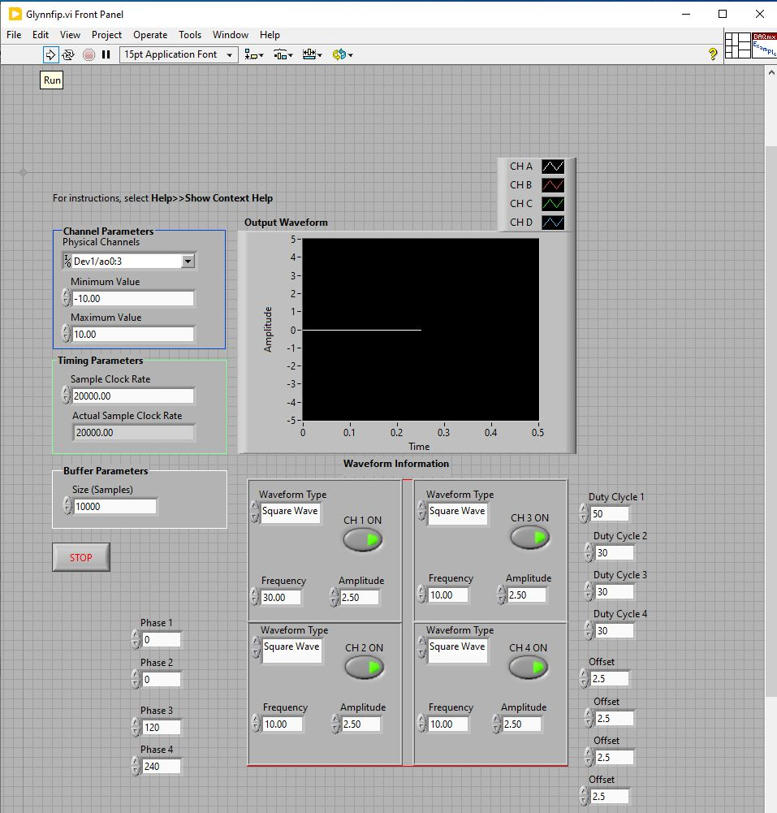

# Multi-color Fiber Photometry

This repository contains code and documentation for a flexible and versatile system for multi-color fiber photometry using GCaMP6s and ChrimsonR. The system is designed to enable researchers to perform high-quality, reliable fiber photometry experiments using a variety of experimental designs. 

## Features

- Multi-color fiber photometry system
- Compatible with GCaMP6s and ChrimsonR
- Flexible and versatile design for use with a variety of experimental designs
- High-quality and reliable data collection

## Getting Started

To order parts and set up hardware, see the parts list below: 

| Item Number | Description | ECCN | Quantity | Price Each | Amount |
|-------------|-----------------------------------------------------------------------------------------------------------|------|----------|------------|------------|
| M470F4      | 470 nm, 14 mW (Min) Fiber-Coupled LED, 1000 mA, SMA                                                       | -    | 1        | $285.18    | $285.18    |
| LEDD1B      | T-Cube LED Driver, 1200 mA Max Drive Current (Power Supply Not Included)                                  | -    | 1        | $341.26    | $341.26    |
| T21S31      | Fiber Stripping Tool, Cladding/Coating Range: 435 - 500 µm / 635 - 787 µm                                | -    | 1        | $76.19     | $76.19     |
| LF30D       | 6" x 6" Diamond Lapping (Polishing) Sheets, 30 µm Grit (5 Sheets)                                        | -    | 1        | $41.96     | $41.96     |
| LF5P        | 11" x 9" Silicon Carbide Lapping (Polishing) Sheets, 5 µm Grit (10 Sheets)                              | -    | 1        | $16.08     | $16.08     |
| LF3P        | 11" x 9" Aluminum Oxide Lapping (Polishing) Sheets, 3 µm Grit (10 Sheets)                               | -    | 1        | $16.08     | $16.08     |
| LFCF        | 6" x 6" Final Lapping (Polishing) Sheets, 0.02 µm Grit (5 Sheets)                                        | -    | 1        | $41.96     | $41.96     |
| B10410A     | SMA905 Multimode Connector, Ø410 µm Bore, SS Ferrule, for BFT1                                           | -    | 3        | $25.63     | $76.89     |
| S120-25     | Ø2.5 mm Ferrule Adapter Cap with Internal SM1 (1.035"-40) Threads                                        | -    | 1        | $44.51     | $44.51     |
| RJPFF4      | FC/PC to Ø2.5 mm Ferrule Rotary Joint Patch Cable, Ø400 µm Core, 3 m Long                               | -    | 1        | $395.56    | $395.56    |
| RJPSF4      | SMA to Ø2.5 mm Ferrule Rotary Joint Patch Cable, Ø400 µm Core, 3 m Long                                 | -    | 1        | $395.56    | $395.56    |
| AD11F       | SM1-Threaded Adapter for Ø11 mm, ≥0.35" (8.9 mm) Long Cylindrical Components                             | -    | 2        | $32.53     | $65.06     |
| ER1         | Cage Assembly Rod, 1" Long, Ø6 mm                                                                        | -    | 4        | $5.49      | $21.96     |
| ER4         | Cage Assembly Rod, 4" Long, Ø6 mm                                                                        | -    | 4        | $7.53      | $30.12     |
| SM1CP2      | Externally SM1-Threaded End Cap                                                                           | -    | 2        | $19.86     | $39.72     |
| SM1SMA      | SMA Fiber Adapter Plate with External SM1 (1.035"-40) Threads                                            | -    | 1        | $32.29     | $32.29     |
| SM2T2       | SM2 (2.035"-40) Coupler, External Threads, 1/2" Long                                                     | -    | 1        | $39.67     | $39.67     |
| TR1         | Ø1/2" Optical Post, SS, 8-32 Setscrew, 1/4"-20 Tap, L = 1"                                               | -    | 1        | $5.27      | $5.27      |
| LCP34       | 60 mm Cage Plate, SM2 Threads, 0.5" Thick, 8-32 Tap (Two SM2RR Retaining Rings Included)                 | -    | 1        | $43.37     | $43.37     |
| LCP33       | 30 mm to 60 mm Cage Plate Adapter, 8-32 Tap                                                               | -    | 1        | $44.51     | $44.51     |
| RS2P        | Ø1" Pedestal Pillar Post, 1/4"-20 Taps, L = 2"                                                           | -    | 3        | $30.53     | $91.59     |
| FBH410-10   | Bandpass Filter, Ø25 mm, CWL = 410 nm, FWHM = 10 nm                                                      | -    | 1        | $158.21    | $158.21    |
| FBH470-10   | Bandpass Filter, Ø25 mm, CWL = 470 nm, FWHM = 10 nm                                                      | -    | 1        | $158.21    | $158.21    |
| SM1A12      | Adapter with External SM1 Threads and Internal M25 x 0.75 Threads                                       | -    | 1        | $23.06     | $23.06     |
| F671SMA-405 | 405 nm, f = 4.02 mm, NA = 0.60 SMA905 Fiber Collimation Pkg.                                            | -    | 2        | $173.90    | $347.80    |
| LEDD1B      | T-Cube LED Driver, 1200 mA Max Drive Current (Power Supply Not Included)                                | -    | 2        | $341.26    | $682.52    |
| DMLP425R    | 25 mm x 36 mm Longpass Dichroic Mirror, 425 nm Cut-On                                                    | -    | 1        | $268.22    | $268.22    |
| ER025       | Cage Assembly Rod, 1/4" Long, Ø6 mm                                                                      | -    | 8        | $5.35      | $42.80     |
| PH082E      | Ø1/2" Pedestal Post Holder, Spring-Loaded Hex-Locking Thumbscrew, L=1.00"                                | -    | 1        | $26.24     | $26.24     |
| M405FP1     | 405 nm, 19.3 mW (Min) Fiber-Coupled LED, 1400 mA, SMA                                                    | -    | 1        | $698.50    | $698.50    |
| M59L01      | Ø1000 µm, 0.50 NA, SMA-SMA Fiber Patch Cable, Low OH, 1 Meter                                            | -    | 2        | $132.26    | $264.52    |
| CF125C-P5   | Clamping Fork, 1.24" Counterbored Slot, 1/4"-20 Captive Screw, 5 Pack                                    | -    | 1        | $58.69     | $58.69     |
| KCH601      | USB Controller Hub and Power Supply for Six K-Cubes or T-Cubes                                           | -    | 1        | $696.10    | $696.10    |
| POWER CORD USA | KCH601:POWER CORD USA : No Cost Accessory                                                               | -    | 1        | $0.00      | $0.00      |
| M470F4      | 470 nm, 14 mW (Min) Fiber-Coupled LED, 1000 mA, SMA                                                       | -    | 1        | $285.18    | $285.18    |
| MB1224      | Aluminum Breadboard 12" x 24" x 1/2", 1/4"-20 Taps                                                       | -    | 1        | $296.51    | $296.51    |
| CP33        | SM1-Threaded 30 mm Cage Plate, 0.35" Thick, 2 Retaining Rings, 8-32 Tap                                  | -    | 2        | $18.71     | $37.42     |
| DFM1        | Kinematic Fluorescence Filter Cube for Ø25 mm Fluorescence Filters, 30 mm Cage Compatible, Right-Turning  | -    | 2        | $407.30    | $814.60    |
| DFM1T1      | Kinematic 30 mm Cage Cube Insert for Ø25 mm Fluorescence Filters, DFM1 Series, Right-Turning              | -    | 2        | $285.33    | $570.66    |
| ERSCB       | Rod Adapter for Ø6 mm ER Rods, L = 0.27"                                                                | -    | 8        | $15.83     | $126.64    |
| CFLC126-10  | Ø1.25 mm, 6.4 mm Long Ceramic Ferrule for SM Fiber, Ø126 µm Bore Size, 10 Pack                            | -    | 10       | $22.26     | $222.60    |
| RJPF4       | FC/PC to FC/PC, Ø400 µm, 0.39 NA, Rotating Patch Cable, 2 m Long                                          | -    | 1        | $407.48    | $407.48    |
| XCL         | Stereotaxic Cannula Holder, Ø1.25 mm Ferrules                                                           | -    | 1        | $358.64    | $358.64    |
| XCF         | Stereotaxic Cannula Holder, Ø2.5 mm Ferrules                                                            | -    | 1        | $358.64    | $358.64    |
| ADAL1-5     | Ceramic Split Mating Sleeves for Ø1.25 mm (LC/PC) Ferrules, 5 Pack                                        | -    | 10       | $20.96     | $209.60    |
| ADAF1-5     | Ceramic Split Mating Sleeves for Ø2.5 mm (FC/PC, ST/PC, or SC/PC) Ferrules, 5 Pack                          | -    | 10       | $23.27     | $232.70    |

## Installation

Once hardware is set up, install the system by following steps:

1. Clone the repository to your local machine
2. Install the required dependencies (list of dependencies here)
3. Follow the instructions in the documentation to set up and use the system

## Python App
1. Open the repository and execute the `main.py` script.
2. Click on "New" to specify the folder for data storage.
3. Select "Set Parameters" to choose the region of interest.
4. Click on "Plot" and "Record" to start recording.

## LabView
1. Create a blank VI by clicking on the block diagram (blank white background without grid), and right-click to open the functions palette: Measurement I/O > Daqmx data acquisition > daq assistant.

   

2. Choose "Generate Signal" and "Analog Output Voltage" in the DAQ assistant.

   

3. Verify that AO 0 through AO 3 are selected channels.

   

4. Click "OK" and wait for the VI to build (this may take a few seconds).

   

5. Open the `glynnfip.vi` file.

   

6. Configure the settings for the `glynnfip.vi`.

   

7. Click the "Run" button to start the execution.

## Notation
Before starting each experiment, ensure that you run the Python app first and then the LabView app to synchronize the recording process. 
Before commencing a new experiment (recording), it is important to follow these steps:

1. Stop the `glynnfip.vi` app by clicking the "Stop" button.
2. Set all offsets and amplitudes to 0 in the `glynnfip.vi` app.
3. Run the `glynnfip.vi` app for a short period and then stop it. This aims to reinitialize `glynnfip.vi` to the original state.
4. After reinitializing the `glynnfip.vi` app, set all offsets and amplitudes to 2.5.
5. Start the Python app by following steps 1 to 4 for recording.
6. Click the "Run" button in the `glynnfip.vi` window to begin data acquisition.

## Usage

To use the system, follow these steps:

1. Set up the hardware and software according to the instructions in the documentation
2. Design and run your experiment using the system
3. Collect and analyze your data using the provided code and tools

## Contributing

Contributions to this project are welcome and encouraged. To contribute, please follow these steps:

1. Fork the repository
2. Create a new branch for your changes
3. Make your changes and commit them with clear, descriptive commit messages
4. Push your changes to your forked repository
5. Create a pull request with a clear description of your changes

## License

This project is licensed under the [MIT License](https://opensource.org/licenses/MIT). See the [LICENSE](LICENSE) file for details.

        Open the Start Menu and search Turn Windows features on or off
        Select Windows Subsystem for Linux
        Click OK
        Restart your computer when prompted

